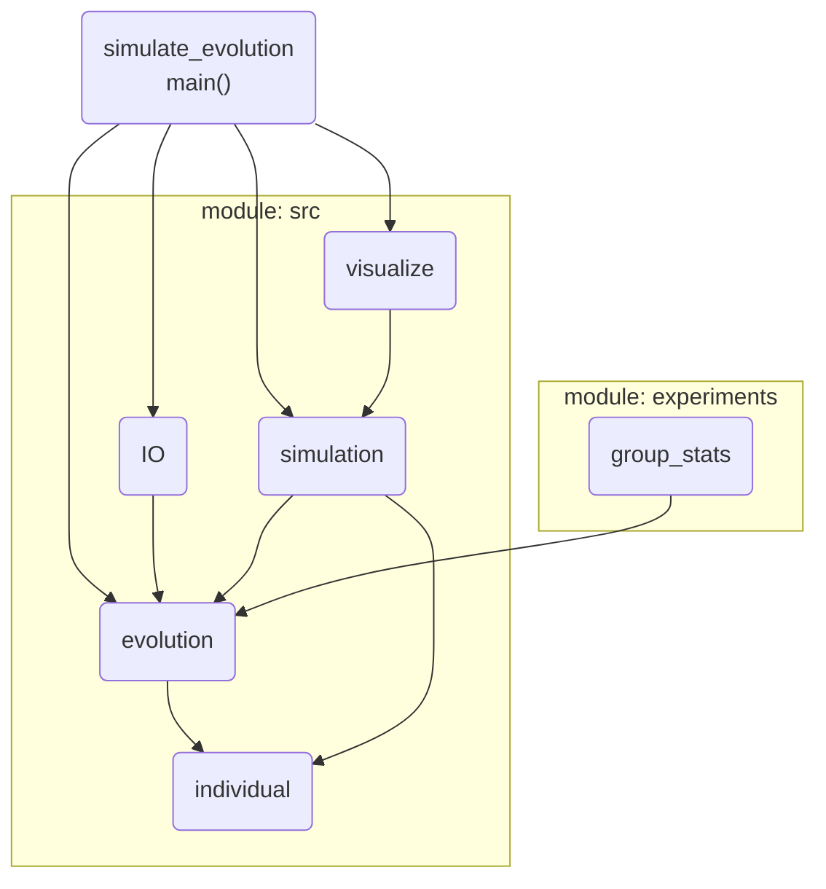

# LIFPROJET

Project on evolution based learning of movement.

The base creature is a four-legged individual that has to learn to coordinate its limbs. Furthermore, the size of each limb can be modified throughout the evolution. Motion is realized by applying a motion pattern to each limb (a series of steps to take) of varying length. After each generation, sizes and motion patterns will be crossed, such that the individual learns to optimally use limbs given a certain size.


## Install 

A minimum python version of 3.7 is required to run the program. Install all required python modules as follows:  
``` 
python -m pip install --upgrade pip
pip install -r requirements.txt 
```

## Documentation

After cloning the repository to your local machine, you can open the documentation from here: `doc/_build/html/index.html`


## Usage

To run the script use:

`python simulate_evolution.py [args]`

Type `python simulate_evolution.py -h` obtain the output below for possible arguments:

```
usage: simulate_evolution.py [-h] [-i INDIVIDUALS] [-g GENERATIONS]
                             [-d DURATION] [-gc] [-e EVOLUTION_DIR]
                             [-gen GENERATION] [-nt] [-s] [-o] [-c CORES] [-v]
                             [-f] [-sd SLOW_DOWN_FACTOR] [-nb] [-ss]

optional arguments:
  -h, --help            show this help message and exit
  -i INDIVIDUALS, --individuals INDIVIDUALS
                        number of individuals per generation - In case visualization mode was chosen, a random set of
                        i individuals will be chosen for displaying (default=10)
  -g GENERATIONS, --generations GENERATIONS
                        number of generations to be evolved (default=10)
  -d DURATION, --duration DURATION
                        duration of each simulation in seconds - Final fitness is obtained after that time
                        (default=10)
  -gc, --get_config     only create default config file and exit
  -e EVOLUTION_DIR, --evolution_dir EVOLUTION_DIR
                        parent directory for the evolution to be stored or loaded from (default=example)
  -gen GENERATION, --generation GENERATION
                        generation on which to continue evolution or generation to display if visualization mode was
                        chosen - Set -1 for latest (default=-1)
  -nt, --no_tracking    disable tracker for individuals
  -s, --save_gene_pool  Save all gene pools per generation to new folder
  -o, --overwrite       overwrite existing data
  -c CORES, --cores CORES
                        number of CPU cores for simulating one generation - Set to -1 for all cores (default=-1)
  -v, --visualize       visualize results - specify evolution directory with the help of -e
  -f, --follow_target   whether to follow the target with the GUI camera
  -sd SLOW_DOWN_FACTOR, --slow_down_factor SLOW_DOWN_FACTOR
                        divide GUI update speed by this value
  -nb, --not_only_best  do not show result of best, but rather -i random individuals
  -ss, --show_stats     whether to show statistics on the evolution - If set, statistics and not rendered individuals
                        are shown
  ```

Note that there are two different modes in which the script can be used: simulation and visualization mode. Within the simulation mode the evolution is simulated according to the specifications. The visualization mode can be used to readout the result of the evolution.

## Arguments explained

`-i <int>` example: `-i 100`

The number of individuals that are initially created. It is ensured that the number of individuals cannot change during the evolution. When performing the crossing it is thus ensured that as many parent pairs are selected as individuals were present in the parent generation.

`-g <int>` example: `-g 80`

The number of times the gene pool will be updated. Note that when continuing on an evolution, this number will determine the amount of additional generations that will be computed. Pay attention to the number in the `.json` file (explained below), because when continuing an evolution the number from the configuration will be interpreted as additional generations to be computed.

`-d <int>` example: `-d 40`

Fiteness of each individual is defined as the distance it can make between it's origin of creating and the point were it is located after a certain amount of time. This time is defined here and is specified in seconds. Thus, using the above example will simulate each individual for 40s and evaluate the fitness at the last time point. Note, that during evolution (where no GUI output is shown), 40s do not correspond to actual real time 40s, but rather the amount of update steps, given a certain frame rate. If the frame rate was set to 240 frames per second (fps), then 240 * 40 updates will be performed during the simulation of one individual.

`-gc`

Flag indicating that only a configuration file was requested. The configuration file is created according to other arguments passed to the function and stored either in the `example` directory, or a new directory based on the specifications, if the `-s` flag was added as well.

`-e <str>` example: `-e /my/path/to/where/evolution/takes/place`

Defines the parent directory of the current simulation (default is `/example`). All results will be stored here or read from.

`-gen <int>` example: `-gen 42`

The generation selected from a pre-computed evolution. This can either be the generation from the evolution is asked to be continued from, or the generation selected for displaying results. In case `-gen -1` is set, the last generation present will be used. Note that in order for this argument to take effect, at least one `gen_<int>.pkl` file must be present in the evolution directory.

`-nt`

By default the location of every individual during simulation is recorded for every 10th step. Since this can yield relatively large file sizes when storing tracking data, this flag ommits tracking from the simulation and thus only stores the tracked path for the very last simulation (generation). Furthermore, it is necessary to add this flag, if statistics are requested to be shown (see `-ss` flag), if there is no tracking information present in the respective evolution directory.

`-s`

Adding this flag will create a new folder for the simulation were all data is stored. The folder will be called `/all_gene_pools_<specifications>` where "specifications" is replaced by the number of generations, individuals and simulation duration. Furthermore adding this flag will cause the program to store every generation of the evolution process as a single `gen_<int>.pkl` file. If you wish to save all data to a newly created folder, but want to ommit storing all generations separately, create a new folder manually and give it as a value to the `-e <str>` argument.

`-o`

Overwrites existing data. By default the program will continue on the last generation present in the folder (if not specified otherwise). This flag will cause the program to start over from generation 0 and overwrite existing files.

`-c <int>` example: `-c 8`

The number of CPU cores utilized to perform the simulations of individuals in parallel. By default this argument is set to `-c -1` which utilizes all available CPU cores. In general the simulation of each individual in the physics environment, takes up most computational ressources. However, since all individuals are independent of each other, the simulation can be parallelized. Thus, the program splits up the amount of individuals into as many chunks as CPU cores were requested and performs those simulations in parallel. Afterwards, the results are concatenated and the crossing is performed. For each core an individual physics server will be created in the background.

`-v`

Evokes the visualization mode. Without adding any of the flags listed below in the above help output, this flag will show a GUI instance, enabling the observation of one or multiple individuals during the simulation. Note that the simulation will take place for as many real time seconds as specified using `-d <int>`. If `-d -1`, the simulation does not stop after a fixed amount of time and has to be terminated using the "Quit" command from the drop down menu of the simulation GUI window. Furthermore, it is possible to select a specific generation to show using the `-gen <int>` argument.

After the simulation has finished (or was aborted by the user), an overview plot of all the paths the individuals took is evoked.

`-f`

Causes the GUI camera to follow the first individual in the requested population (if `nb` was not set, this will be the best individual of the selected generation).

`-sd <float>` example: `-sd 2.5`

Slow down factor. Sometimes it can become handy to slow down the simulation to observe detailed behavior of an individual. In the above example, the simulation would go 2.5 times slower, such that the time specified using `-d <int>` is multiplied by 2.5 and update steps are performed at a frame rate of fps / 2.5 . It is possible to use values between 0 and 1 to increase the speed of the simulation likewise.

`-nb`

By default, only the best individual of the selected simulation is shown. This behavior can be supressed by adding this flag. In that case the amount of individuals will be displayed, that was defined using `-i <int>`. Note that those individuals are randomly selected if less individuals were requested than present in the population.

`-ss`

Causes visualization mode to not display a rendered simulation, but rather plot overview statistics, such as average performance over generations and paths for some generations. If no path tracker file is present or path plots are not desired, combining this flag with `-nt` is advisable.


## Recommended test procedure

Run simulation of the example creature evolved from a pre-computed evolution at 10 times speed and follow the creature with camera:

`python simulate_evolution.py -v -f -sd 0.1 -e evolved_creatures\two_leg_side_walker`

Run an evolution of 10 individuals over 5 generations, simulating each individual for 40s where results shall be stored in a new folder and all available cores shall be used:

`python simulate_evolution.py -i 10 -g 5 -d 40 -c -1 -s`

Display the 4nd generation of the simulation above for 20s at half speed:

`python simulate_evolution.py -v -gen 4 -d 10 -sd 2 -e <path/to/above/simulation>` Note that 10s of simulation are shown with a slow down factor of 2, yielding 20 real time seconds that are displayed.

Display the plots that present the performance of the evolution above: 

`python simulate_evolution.py -v -ss -e <path/to/above/simulation>` e.g. for path /all_gene_pools_5gen_10ind_40dur_01-07-2020-20-48-19

Change the configuration file of the evolution above such that only 2 more generations would be computed: 

`python simulate_evolution.py -i 10 -g 2 -gc -o -e <path/to/above/simulation>`

Add 2 more generations to the evolution above and save their data: 

`python simulate_evolution.py -s -e <path/to/above/simulation>`

Show plots from experiments that are described more detailed below: 

`python experiments/group_stats.py`


## Results

For each evolution a `evo_config.json` file is used to store main parameters of the evolution. Furthermore, a `stats.csv` and `fitness.csv` file store basic statistics such as average fitness and fitness per generation and individuals. A `tracker.pkl` file is requested storing the paths of each individual for each simulation. Supress requested tracker file by adding `-nt` to the simulation command. 

The script `experiments/group_stats.py` shows plots for experiments with different mutation rates once using symmetic and once non-symmetric individuals each experiment having 30 trials. It shows a box plot for the last generation of all experiments once in normal size and once "zoomed in" to be able to read all results properly. Furthermore, one will see 2 plots containing the average performance over all generations one for the experiments with symmety and the other one for the experiments without symmetry.  

### evo_config.json

an example `evo_config.json` file looks like this:

```
{
"individuals": 
    {
    "min_box_size": 0.3,              -> minimum half size of initial randomly created boxes
    "max_box_size": 1.0,              -> maximum half size of initial randomly created boxes
    "random_box_size": true,          -> use random boxes - if false, the average of the above is used as fixed size
    "symmetric": false,               -> whether the individual is symmetric with respect to the sizes of it's limbs 
    "min_force": 100,                 -> minimum force per limb
    "max_force": 500,                 -> maximum force per limb
    "start_move_pattern_size": 240,   -> size of the initial moving pattern (at 240 fps, this corresponds to 1s of steps)
    "vary_pattern_length": true,      -> whether to vary the length of the motion pattern by evolution
    "normalize_move_pattern": false,  -> whether to normalize the move pattern such that all step sizes sum up to 2 pi
    "standard_volume": 2.197          -> scales the mass to be at 1 if the cube is shaped 1.3^3 (default half size * 2)
    }, 
"simulation": 
    {
    "fps": 240,                       -> update simulations so many times per second
    "colormap": "viridis",            -> color scheme for individuals that are rendered (randomly chosen from colormap)
    "generations": 200,               -> number of generations to be evolved
    "individuals": 80,                -> number of individuals per generation
    "duration": 40                    -> duration of the simulation for each individual in seconds
    }, 
"evolution": 
    {
    "mutation_prob_ind": 0.05,        -> probability for an individual to mutate
    "mutation_prob_gene": 0.05,       -> probability for a gene to mutate
    "mutation_prob_feature": 0.05,    -> probability for a feature of that gene to mutate
    "alpha_limits": 0.5               -> alpha value for computing limits for choosing the value after crossing
    }
}
```
## Organisation of scripts




### individual

##### sizes
All individuals consist of 6 boxes and 6 spheres (actually 11 spheres since 2 spheres overlap at each connection gutted the head). Boxes are: chest, hip, left / right arm and left / right leg. Spheres are: head, waist, left / right shoulder and left / right hip joint.

Each box is initialized such, that the mass (on average) per box is 1. This is due to the fact that the half-size of each box is a random value between 0.3 and 1.0 (for the default settings), which on average is 0.65. Since this value defines the half-size each box is on average shaped 1.3 * 1.3 * 1.3 and thus has a standard volume of 2.197 which corresponds to mass of one. If values are changed, consider adapting the standard mass.

##### forces
To each sphere (except the head) a force is added, moving the limb in x and / or z direction. The force is depending on the mass, but capped. It is computed according to this formula:

`1 / (1 / max_force + np.exp(-mass * 3)) + min_force`

which creates a sigmoid function f such that force = f(mass) between min_force and max_force. Hence there is an optimal range were the best volume - force tradeoff is achieved, preventing boxes from getting too small and too big.

##### moving pattern
Each limb has an assigned movment pattern. Its array values are called sequentially one for each simulation step. If the end of the pattern is reached, it will repeat.

If requested the movement pattern can be normalized to (e.g.) 2 pi. This would make the sum of all step sizes (absolute values) in the pattern be of 2 pi. Hence it is ensured, that no more than one "round" of a circle can be made per cycle.

### evolution

main functionalities of this script are: 

##### fitness
The fintess is computed as the L2 norm between [0, 0] and the coordinate of any individual at the last time step of the simulation. Note that the z coordinate is ignored.

##### selection
For selecting individuals to carry their genome to the next generation, the fitness is ranked descending, and individuals are selected based on "Concepts fondamentaux des algorithmes évolutionnistes" by Jean-Baptiste Mouret. Once individuals that are allowed to carry their genes over to the next generation are selected, as many pairs as there were individuals in the original population are formed. Thereby individuals are combined randomly with other individuals, ensuring that every individual has been chosen at least once.

##### crossing
Crossing is performed gene wise. For each pair of values a random value is selected between the limits [o - d / 2 - a * d, o + d / 2 + a * d], where "o" is the average of the value pairs, "d" the absolute difference and "a" a value to enlarge the search space linearly (in the default case a = 0.5). Thus a random r value would be selected such that o - d / 2 - d * a < r < o + d / 2 + a * d. This procedure is repeated for every value- pair across the parent genomes. Afterwards mutation is applied with a certain probability.

##### mutation
Mutation is realized as a random re-initialization of certain features of the genome. Thereby 3 different probabilities can be tuned. 1) the probability that the inidivual mutates at all, 2) the probability that a certain gene mutates (e.g. size of the left hand) and 3) the probability for a certain feature to mutate (e.g. the y size of the left hand).

### IO

* manages the user input e. g. generation of a jason configuration file 
* can generate, read or load a jason configuration file
* can save or load the output of an evolution like the fitness for each individual 

### simulation 

* sets up the physics simulation and simulates all individuals 
* handels multi-core processing for windows and unix io systems

### visualize 

* can render a GUI based simulation for selected individuals
* can be used to show a plot of the average and best performance of eah generation during an evolution
* shows the path that an individual or multiple individuals have traveled in a plot if requested 

### group_stats

* shows all plots that can be generated from experiments that have been executed on a cluster 

